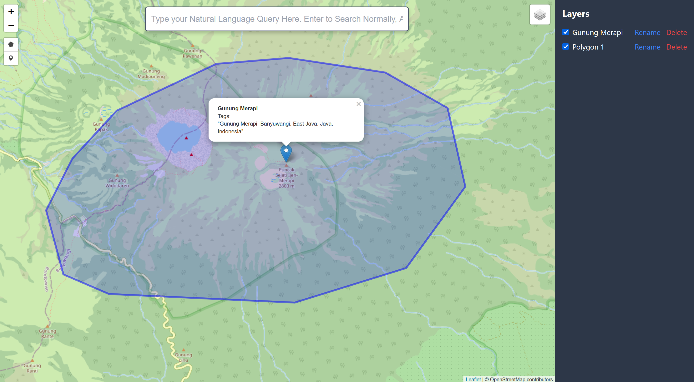

# Atlas

**Atlas** is a proof-of-concept geoanalysis tool that lets a user query a map using natural language. It was created as part of NOVA 2024, a one-day GenAI-themed hackathon hosted by ScottyLabs at Carnegie Mellon University on 9 November 2024. Our team, consisting of Alistair Cheong, Luke Hann, Nuode Chen, and Hani Murtaza clinched the Best Technical Implementation award for this project.

The motivation behind Atlas stems from the challenges faced during humanitarian crises. When disasters strike, aid teams must rapidly assess affected areas and integrate fragmented data (such as damaged roads, hospital locations, etc.) to formulate response plans. Atlas aims to streamline this process by offering an intuitive, natural language interface to a map, enabling users to quickly extract relevant information.

## How it works ([Full demo video link here](media/demo.mp4))

- Users input queries in natural language in the search bar at the top. They can do conventional keyword searches by hitting `Enter` or perform Atlas natural language searches by hitting `Alt+Enter`.
- Each query is displayed as a separate layer on the map, allowing users to toggle between multiple queries easily.
- Users can drop points on the map to ground their queries. They can also draw polygons to limit the area of interest.
- When `Enter` is pressed, the query is sent to the [Nominatim API](https://nominatim.org/) which uses Open Street Map data to find the coordinates of the query.
- When `Alt+Enter` is pressed, the natural language query is embedded in a prompt which instructs GPT-4o to generate an [Overpass query](https://wiki.openstreetmap.org/wiki/Overpass_API/Overpass_QL) to interact with OpenStreetMap. That Overpass query is sent to OpenStreetMap, which returns the relevant data. 

## Industry applications
- **Humanitarian Aid**: Atlas can be used by NGOs and aid organizations to quickly assess the impact of disasters, such as earthquakes or floods, by querying for damaged infrastructure, hospitals, and shelters. Suppose the [Humanitarian OpenStreetMap Team (HOTOSM)](https://www.hotosm.org/) connected Atlas to its data sources. Then Atlas could provide fast access to mapping data for regions that Google Maps or Apple Maps do not have good coverage of.
- **Urban Planning**: City planners can use Atlas to analyze land use, zoning, and infrastructure development.
- **Environmental Monitoring**: Researchers can query specific regions for environmental data, such as deforestation rates or pollution levels.
- **Security and Counter-Terrorism**: Law enforcement agencies can query an environment for features that match eyewitness accounts to speed up their search for perpetrators.

## Setup
1. Clone and install required depenedncies from `requirements.txt` in a separate Python `venv`.
2. Create a file `secrets.env` in the root directory and put `OPENAI_API_KEY=your_key`.
3. Navigiate to the root directroy of this project, and `flask run --debug`.

## Citations
I thought of this hackathon idea independently, based on my prior experience attending a mapathon to annotate data for the Humanitarian OpenStreetMap Team. While searching for related work in this space, we came across the ChatGeoPT project: [GitHub repo](https://github.com/earth-genome/ChatGeoPT), [blog](https://medium.com/earthrisemedia/chatgeopt-exploring-the-future-of-talking-to-our-maps-b1f82903bb05), which did something very similar with a natural language geospatial search. As we were under a time crunch, we split our work into 2 phases: (1) build the core functionality of natural language search first, and (2) differentiate by tailoring the product towards humanitarian aid and data sources from HOT. During the 7-hour hackathon, we only managed to implement (1) in code. (2) was discussed in our oral presentation. We are grateful to the ChatGeoPT project for their work, which heavily inspired the current implementation.
